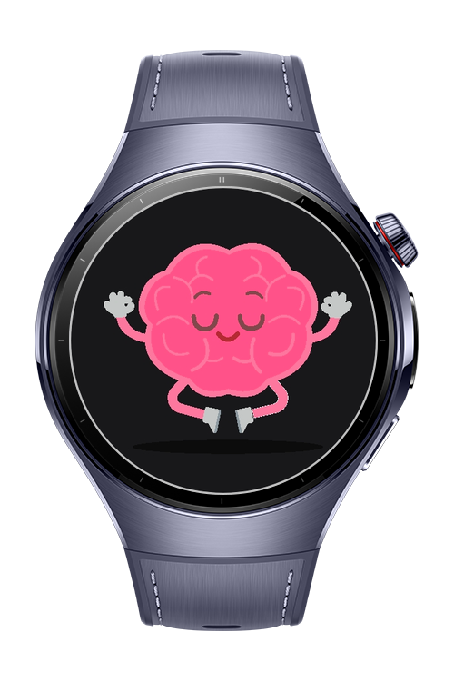
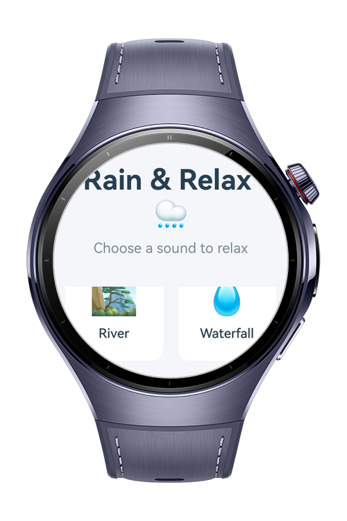
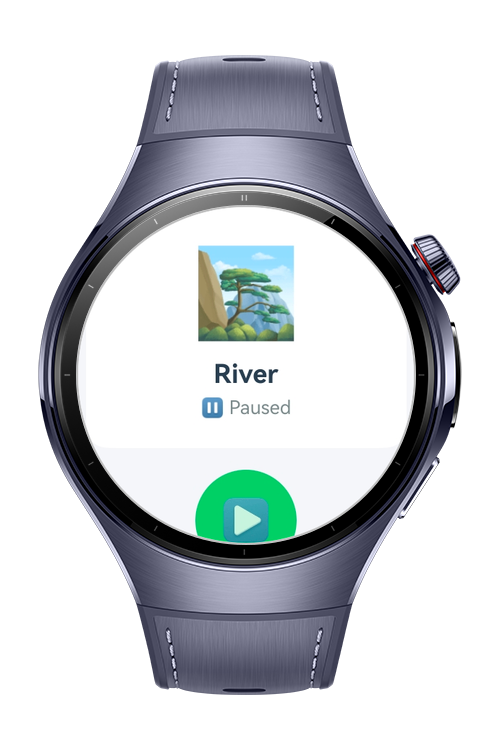
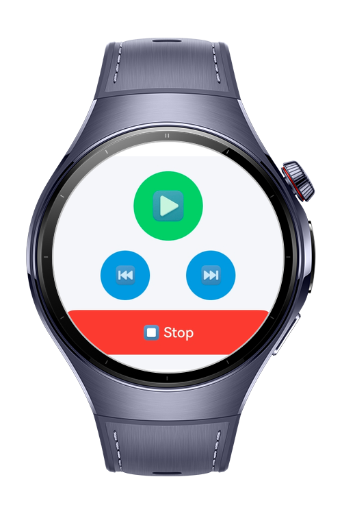

> **Note:** To access all shared projects, get information about environment setup, and view other guides, please visit [Explore-In-HMOS-Wearable Index](https://github.com/Explore-In-HMOS-Wearable/hmos-index).

# Serenity - Rain & Relaxation Sounds
A peaceful HarmonyOS ArkTS application that plays ambient nature sounds for relaxation and focus. Features beautiful animations, background playback, and a clean, intuitive interface. Perfect for meditation, sleep, or concentration.

# Preview
<div>
     
     
     
    
</div>

# Features
- Browse and select from various relaxing ambient sounds (rain, ocean, forest, etc.)
- Background audio playback with media controls
- Play, pause, skip forward/backward between sounds
- Set sleep timers (5, 10, 15 minutes)
- Beautiful splash screen animation
- Continues playing even when app is minimized
- AVSession integration for system media controls

# Technology

## Stack

**Languages**: ArkTS

**Frameworks**: HarmonyOS SDK 5.1.0 (18)

**Tools**: DevEco Studio Vers 5.1.0.842

**Libraries**: @kit.AVSessionKit, @kit.AbilityKit, @kit.BackgroundTasksKit, @kit.MediaKit, @kit.AudioKit, @ohos/lottie

## Required Permissions

- `ohos.permission.KEEP_BACKGROUND_RUNNING`
- `ohos.permission.INTERNET`

# Directory Structure
```
entry/
└── ets/
    ├── entryability/
    │   └── EntryAbility.ets
    ├── model/
    │   └── SoundModel.ets
    ├── pages/
    │   ├── Index.ets
    │   ├── DetailPage.ets
    │   └── SplashPage.ets
    └── service/
        └── AudioPlayerService.ets
```

# Use Cases
- Relaxation and meditation sessions
- Background ambiance for work or study
- Sleep aid with auto-stop timer
- Stress relief and mindfulness practice
- White noise for focus and concentration

# Constraints and Restrictions

## Supported Devices
- Huawei Wearables with HarmonyOS

# License
**Serenity** is distributed under the terms of the MIT License
See the [LICENSE](./LICENSE) for more information.
